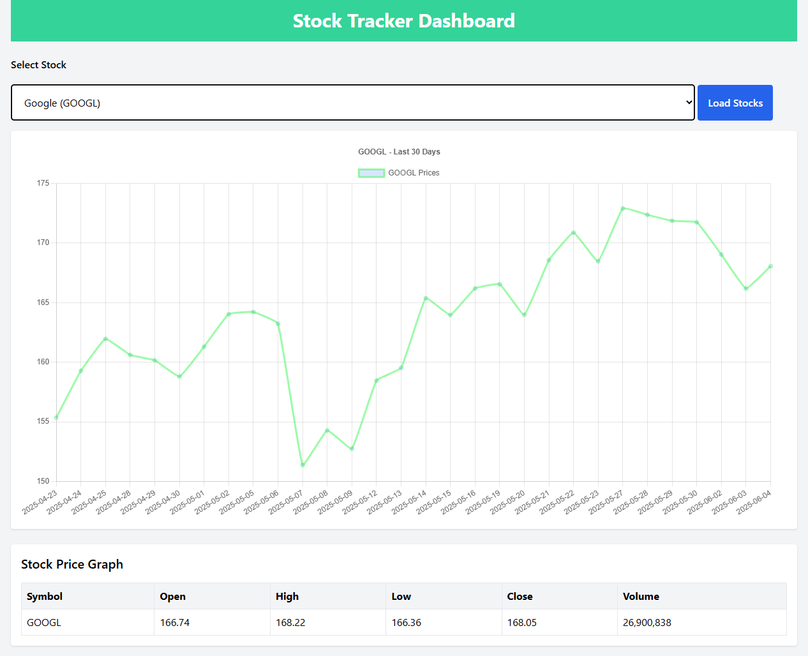
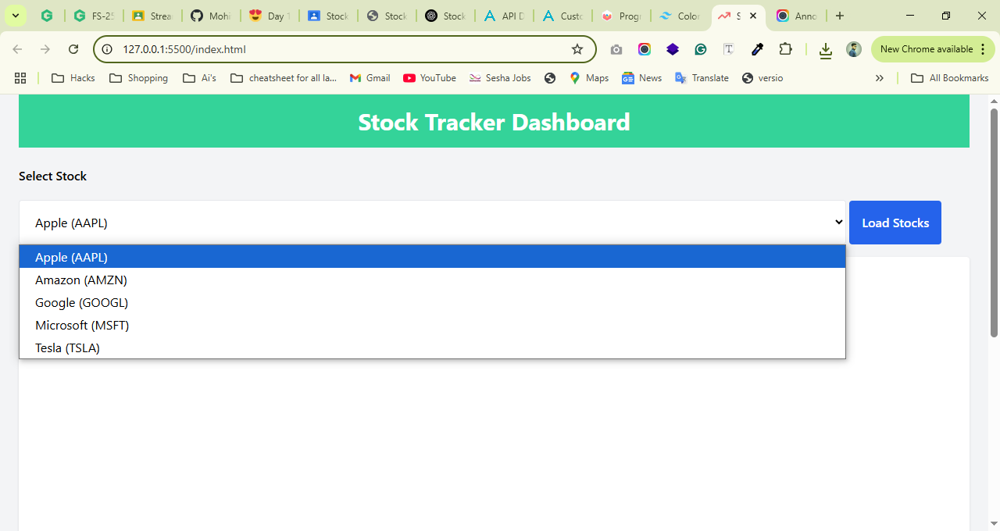

# Stock-Tracker-Dashboard-M4-Remct

This the Stock Tracker Dashboard Ui

Develop using HTML,TailwindCss,Javascript and chart.js.

In this small project we are showing stock data in chart format using chart.js.

In this we are apply api fetch method to fetch data and integrate to charts for convert it into visually apeling in UI.

* Note>> There is api limit reach promblem with this api due to free limitations.
Please call load data visely once api limit reached there will no data showing.

for use convenience I have add alert msg there once api limit reached.

Here is some snapshots

## 📸 Screenshots

;
;